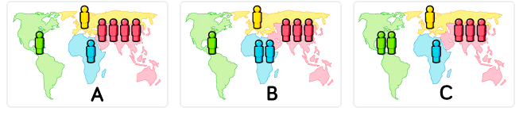

# Quiz-Poster

Titel: DAS **härteste** Quiz der Welt

Untertitel: Deutsche schaffen nur 3 von 13 Punkte

# Fragen

1. Wo lebt die Mehrheit der heutigen Weltbevölkerung?
  * In Ländern mit geringem Pro-Kopf-Einkommen
  * **In Ländern mit mittlerem Pro-Kopf-Einkommen**
  * In Ländern mit hohem Pro-Kopf-Einkommen

2. Wie viele Mädchen absolvieren heute die Grundschule in den Ländern mit niedrigem Einkommen?
  * 20 Prozent
  * 40 Prozent
  * **60 Prozent**

3. In den letzten 20 Jahren hat sich der Anteil der in extremer Armut lebenden Weltbevölkerung...?
  * nahezu verdoppelt.
  * nicht oder nur unwesentlich verändert.
  * **deutlich mehr als halbiert.**

4. Wie hoch ist die durchschnittliche Lebenserwartung bei der Geburt heute weltweit?
  * 50 Jahre
  * 60 Jahre
  * **70 Jahre**

5. Heute leben 2 Milliarden Kinder im Alter von 0 bis 15 Jahren auf der Welt. Wie viele Kinder werden es laut Angaben der Vereinten Nationen im Jahr 2100 sein?
  * 4 Milliarden
  * 3 Milliarden
  * **2 Milliarden**

6. Nach einer Prognose der UN wird die Weltbevölkerung bis 2100 um weitere 4 Milliarden Menschen wachsen. Was ist die Hauptursache dafür?
  * Es wird mehr Kinder geben (jünger als 15 Jahre).
  * **Es wird mehr Erwachsene geben (zwischen 15 und 74 Jahren).**
  * Es wird mehr sehr alte Menschen geben (75 Jahre und älter).

7. Wie hat sich die Zahl der Todesfälle pro Jahr durch Naturkatastrophen über die letzten 100 Jahre entwickelt?
  * Sie hat sich mehr als verdoppelt.
  * Sie ist etwa gleich geblieben.
  * **Sie hat sich mehr als halbiert.**

8. Heute leben circa 7 Milliarden Menschen auf der Erde. Welche Karte zeigt die realistischte geografische Verteilung? (Jede Figur steht für eine Milliarde Menschen.)

Richtige Antwort: A

9. Wie viele der einjährigen Kinder auf der Welt sind gegen irgendwelche Krankheiten geimpft?
  * **80 Prozent**
  * 50 Prozent
  * 20 Prozent

10. Weltweit haben 30-jährige Männer durchschnittlich 10 Jahre lang eine Schule besucht. Wie viele Jahre haben gleichaltrige Frauen die Schule besucht?
  * **9 Jahre**
  * 6 Jahre
  * 3 Jahre

11. 1996 standen der Tiger, der Riesenpanda und das Spitzmaulnashorn auf der Liste der gefährdeten Tierarten. Wie viele dieser drei Spezies sind heute stärker vom Aussterben bedroht als 1996?
  * **Keine**
  * Eine
  * Zwei

12. Wie viele Menschen auf der Welt haben ein gewisses Maß an Zugang zu Elektrizität?
  * 20 Prozent
  * 50 Prozent
  * **80 Prozent**

13. Weltklimaexperten nehmen an, über die nächsten 100 Jahre wird die durchschnittliche Temperatur...
  * **zunehmen.**
  * gleich bleiben.
  * abnehmen.

# Antworttext

1. Die richtige Antwort ist B. Die Mehrheit der Menschen lebt in Ländern mit mittlerem Einkommen. Die World Bank unterteilt die Länder in Einkommensgruppen auf der Basis des Bruttovolkseinkommens pro Kopf in US-Dollar. Laut World Bank leben 10 Prozent der Weltbevölkerung in einkommensschwachen Ländern, 74 Prozent in Ländern mit mittlerem Einkommen und 16 Prozent in Ländern mit hohem Einkommen.
2. Die richtige Antwort ist C. 60 % der Mädchen in einkommensschwachen Ländern schließen die Grundschule ab. Laut World Bank liegt der Wert im Jahr 2017 bei 64,23%.
3. Die richtige Antwort ist B. Laut World Bank ist der Anteil der Menschen, die von weniger als 1,90 US-Dollar pro Tag leben, von 34 Prozent im Jahr 1993 auf 9,9 Prozent im Jahr 2015 zurückgegangen. Der präzise Wert von 1,90 US-Dollar/Tag vermittelt den Eindruck großer Genauigkeit, es bleibt jedoch ein großer Spielraum der Ungewissheit. Extreme Armut ist nur sehr schwer zu beziffern: Die ärmsten Menschen sind zumeist einfache Bauern oder mittellose Slumbewohner, deren Lebensbedingungen entweder unvorhersehbaren oder ständigen Veränderungen unterworfen sind - finanzielle Transaktionen in Verbindung mit diesen Bevölkerungsgruppen sind kaum dokumentiert. Selbst wenn die exakten Einstufungen ungewiss sind, kann man jedoch von einem sicheren Aufwärtstrend sprechen, schon weil die Fehlerquellen über längere Zeit konstant bleiben dürften. Wir können darauf vertrauen, dass der Armutsanteil mindestens auf die Hälfte, vielleicht sogar auf ein Drittel zurückgegangen ist.
4. Die richtige Antwort ist C. Die durchschnittliche Lebenserwartung weltweit liegt für die im Jahr 2018 Geborenen bei 71,95 Jahren gemäß Schätzungen von UN-Pop.
5. Die richtige Antwort ist C. Seit zehn Jahren veröffentlicht UN-Pop Prognosen, denen zufolge die Zahl der Kinder im Jahr 2100 nicht höher sein wird als heute.
6. Die richtige Antwort ist B. In ihren Prognosen berechnen die Experten der UN-Bevölkerungsabteilung, dass sich das Bevölkerungswachstum auf 0,37 Milliarden = 1 Prozent mehr Kinder (bis 14 Jahre), 2,5 Milliarden = 69 Prozent mehr Erwachsene (15 bis 74 Jahre) und 1,1 Milliarden = 30 Prozent mehr sehr alte Menschen (75 Jahre und älter) verteilt.
7. Die richtige Antwort ist C. Die Zahl der jährlichen Todesopfer durch Naturkatastrophen (u.a. Erdbeben, Dürre, Flut, Epidemien) ist laut der Internationalen Datenbank für Katastrophenereignisse in den letzten 100 Jahren um 90 Prozent zurückgegangen. Da solche Katastrophenereignisse von Jahr zu Jahr variieren, vergleichen wir Durchschnittswerte aus Zeiträumen von jeweils zehn Jahren. In den vergangenen zehn Jahren (2009-2018) kamen durchschnittlich 49 467 Menschen pro Jahr durch Naturkatastrophen ums Leben. Das entspricht 10 Prozent der Zahl von vor 100 Jahren (1909-1918) als 483 252 Menschen pro Jahr zu Tode kamen.
8. Die richtige Antwort ist A. Die Weltbevölkerung beträgt im Jahr 2019 laut UN-Pop 7,71 Milliarden. Normalerweise würde dieser Wert auf acht Milliarden aufgerundet, wir arbeiten aber mit sieben Milliarden, weil wir die Bevölkerungszahlen nach Regionen aufgeschlüsselt auf- oder abrunden. Die Bevölkerungszahlen der vier Regionen wurden auf Basis der Länderdaten aus UN-Pop geschätzt: Amerika 1,0 Milliarden; Europa 0,84 Milliarden; Afrika 1,3 Milliarden; Asien 4,4 Milliarden.
9. Die richtige Antwort ist C. 84 Prozent der einjährigen Kinder weltweit sind heute Laut WHO gegen bestimmte Krankheiten geimpft.
10. Die richtige Antwort ist A. Weltweit haben laut Schätzungen von IHME in 188 Ländern Frauen im Alter von 25 bis 34 Jahren durchschnittlich 9,09 Jahre lang eine Schule besucht, Männer 10,21 Jahre. Frauen im Alter von 25 bis 29 Jahren haben durchschnittlich 8,79 Jahre Schulausbildung hinter sich, Männer 9,32.
11. Die richtige Antwort ist C. Keine der drei Spezies ist lauter der Roten Liste bedrohter Arten der Weltnaturschutzunion (IUCN) heute im Vergleich zu 1996
